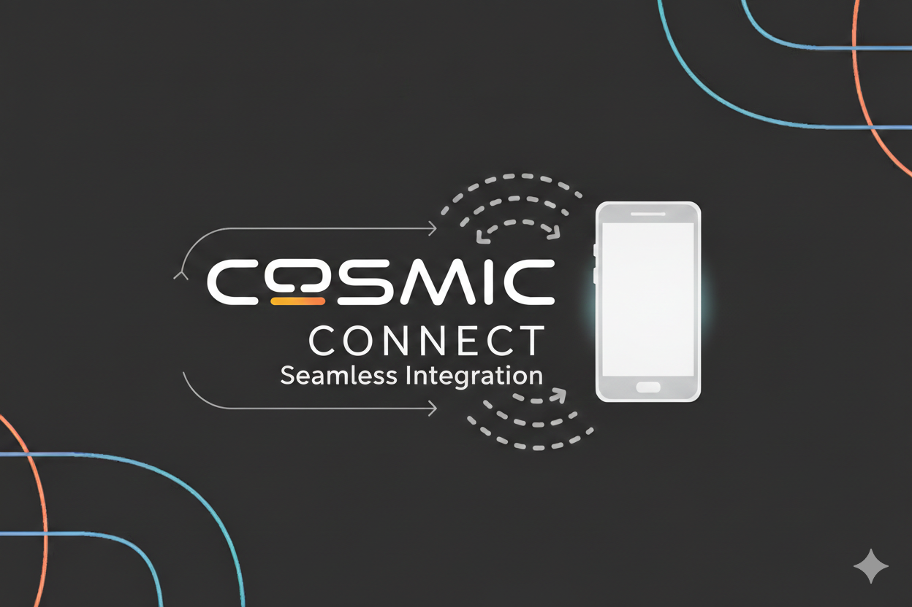

<p align="center">
  
</p>

# COSMIC Connect

A modern, cross-platform device connectivity solution for COSMIC Desktop, written in Rust with 70%+ code sharing between desktop and mobile platforms.

## Overview

**COSMIC Connect** provides seamless integration between your Android devices and COSMIC Desktop, enabling device synchronization, file sharing, notification mirroring, clipboard sync, remote control capabilities, and advanced desktop-to-desktop collaboration features.

This project is part of a **multi-platform ecosystem**:

- **[cosmic-connect-core](https://github.com/olafkfreund/cosmic-connect-core)** - Shared Rust library (protocol, TLS, plugins)
- **[cosmic-connect-desktop-app](https://github.com/olafkfreund/cosmic-connect-desktop-app)** - This repository (COSMIC Desktop)
- **[cosmic-connect-android](https://github.com/olafkfreund/cosmic-connect-android)** - Android app with Kotlin FFI bindings

### Key Innovations

- **70%+ Code Sharing** - Unified Rust core shared between desktop and Android
- **Protocol Independence** - CConnect protocol (v7/8 compatible) with unique port 1816
- **Side-by-Side Operation** - Can run alongside KDE Connect without conflicts
- **No OpenSSL** - Modern rustls-based TLS (better cross-compilation)
- **FFI Bindings** - Kotlin/Swift support via uniffi-rs
- **Modern Async** - Tokio-based concurrent architecture
- **COSMIC Design Compliance** - Hierarchical text, theme integration, WCAG AA+ accessibility

## Architecture

See **[Architecture Documentation](docs/architecture/Architecture.md)** for comprehensive documentation.

```
cosmic-connect-core (Shared Library)
├── Protocol v7 implementation
├── TLS/crypto layer (rustls)
├── Network & discovery
├── Plugin system
└── FFI bindings (uniffi-rs) ──┐
                                │
                                ├──→ Desktop (This Repo)
                                │    ├── cosmic-connect-protocol
                                │    ├── cosmic-connect-daemon
                                │    └── cosmic-applet-connect
                                │
                                └──→ Android App
                                     └── Kotlin via FFI
```

## Components

This repository contains seven main components that work together to provide the full COSMIC Connect experience:

### cosmic-connect-protocol

The **protocol library** implements the CConnect/KDE Connect v7/v8 protocol specification in pure Rust.

| Feature | Description |
|---------|-------------|
| **Packet Handling** | Serialization/deserialization of JSON protocol packets |
| **TLS Layer** | Certificate generation, exchange, and secure channel establishment using rustls |
| **Device Discovery** | UDP broadcast and mDNS service discovery mechanisms |
| **Plugin Framework** | Trait-based plugin system for extensible functionality |
| **Connection Management** | Socket handling, reconnection logic, and transport abstraction |

**Key Modules:**
- `connection.rs` - TCP/TLS connection management with auto-reconnect
- `discovery.rs` - UDP broadcast (port 1816) and mDNS discovery
- `pairing.rs` - Certificate exchange and verification workflow
- `plugins/` - All 22 plugin implementations (ping, battery, share, etc.)

**Usage:** This crate is used internally by the daemon and manager; it's not typically used directly.

---

### cosmic-connect-daemon

The **background service** that handles all device communication, running as a systemd user service.

| Feature | Description |
|---------|-------------|
| **Device Management** | Tracks paired devices, connection state, and trust levels |
| **Plugin Orchestration** | Loads and manages plugins per device based on capabilities |
| **DBus Interface** | Exposes `org.cosmicde.CosmicConnect` for IPC with applet/manager |
| **Notification Forwarding** | Captures desktop notifications via DBus and forwards to devices |
| **Desktop Icons** | Creates `.desktop` files for paired devices in `~/.local/share/applications/` |

**DBus Methods:**
```
org.cosmicde.CosmicConnect
├── GetDevices() → Array<Device>
├── PairDevice(device_id: String)
├── UnpairDevice(device_id: String)
├── SendPing(device_id: String)
├── SendFile(device_id: String, path: String)
├── GetClipboard(device_id: String) → String
├── SetClipboard(device_id: String, content: String)
└── ... (60+ methods for all plugins)
```

**Configuration:** `~/.config/cosmic/com.cosmic.Connect.ron`

---

### cosmic-applet-connect

The **COSMIC panel applet** that provides quick access to device status and common actions.

| Feature | Description |
|---------|-------------|
| **Status Overview** | Shows connected device count with status indicators |
| **Quick Actions** | Ping, send file, clipboard sync from dropdown |
| **Device Cards** | Expandable cards showing battery, connection quality |
| **Onboarding** | First-run wizard for daemon setup and firewall configuration |
| **Pinned Devices** | Quick access to favorite devices in collapsed view |

**Panel Integration:**
- Appears in COSMIC panel's system tray area
- Shows device count badge when devices are connected
- Dropdown provides device list and "Open Manager" button

---

### cosmic-connect-manager

The **standalone window application** for comprehensive device management.

| Feature | Description |
|---------|-------------|
| **Sidebar Navigation** | Device list with search, filtering, and status indicators |
| **Device Details** | Full device info, capabilities, and connection stats |
| **Action Grid** | Context-aware actions based on device type (mobile vs desktop) |
| **File Transfers** | Progress tracking for active transfers |
| **Plugin Settings** | Per-device enable/disable toggles for each plugin |
| **Media Controls** | MPRIS remote control for music/video playback |

**Device-Type Actions:**

| Action | Mobile | Desktop | Description |
|--------|--------|---------|-------------|
| Ping |  |  | Test connectivity |
| Send File |  |  | Share files via dialog |
| Clipboard |  |  | Sync clipboard content |
| Find Phone |  |  | Ring device to locate |
| SMS |  |  | Compose text messages |
| Camera |  |  | Use phone as webcam |
| Contacts |  |  | Sync contact database |
| Screen Share |  |  | VNC desktop sharing |
| Run Command |  |  | Execute remote scripts |
| Power |  |  | Shutdown/suspend remote |

**Launch:**
```bash
cosmic-connect-manager                    # Open manager
cosmic-connect-manager --select-device ID # Open with device selected
cosmic-connect-manager --device-action ID ping  # Execute action directly
```

---

### cosmic-display-stream

The **display streaming library** for using Android tablets as extended displays.

| Feature | Description |
|---------|-------------|
| **Screen Capture** | PipeWire-based desktop capture with portal integration |
| **H.264 Encoding** | Hardware-accelerated video encoding via GStreamer |
| **WebRTC Transport** | Low-latency streaming using WebRTC data channels |
| **Input Forwarding** | Touch/stylus input sent back to desktop (libei/reis) |
| **Multi-Monitor** | Select specific outputs or capture entire workspace |

**Architecture:**
```
┌──────────────┐    PipeWire    ┌──────────────┐    WebRTC    ┌──────────────┐
│ COSMIC       │ ───────────  │  Encoder     │ ────────── │   Android    │
│ Desktop      │               │  (H.264)     │              │   Tablet     │
└──────────────┘               └──────────────┘              └──────────────┘
                                      ▲
                                      │ Touch events
                                      ▼
                               ┌──────────────┐
                               │  Input       │
                               │  (libei)     │
                               └──────────────┘
```

**Status:** Work in progress - basic streaming functional, input forwarding experimental.

---

### cosmic-messages-popup

The **web messenger popup** for responding to messages directly from desktop notifications.

| Feature | Description |
|---------|-------------|
| **WebView Integration** | Embedded browser using wry/WebKitGTK |
| **Session Persistence** | Maintains login state per messenger service |
| **Notification Trigger** | Opens automatically when message notification received |
| **DBus Interface** | `org.cosmicde.MessagesPopup` for daemon integration |
| **Multi-Service** | Supports Google Messages, WhatsApp, Telegram, Signal, Discord, Slack |

**Why Web-Based:**
- Google Messages RCS has no public API
- Maintains end-to-end encryption
- Works with any web messenger
- No reverse-engineering required

---

### cosmic-messages

A **lightweight messages utility** for command-line message operations and testing.

| Feature | Description |
|---------|-------------|
| **CLI Interface** | Send/receive messages from terminal |
| **DBus Client** | Communicates with daemon's message queue |
| **Testing Tool** | Useful for debugging notification flow |

**Usage:**
```bash
cosmic-messages list              # Show message queue
cosmic-messages send DEVICE TEXT  # Send message to device
cosmic-messages dismiss ID        # Dismiss notification
```

---

## Features

### Status: Production Ready

**Version:** 0.1.0
**Protocol:** CConnect v7/8 (KDE Connect compatible)
**Discovery Port:** 1816
**Plugin Count:** 22 plugins (12 core + 10 advanced)

#### Core Features

- **Device Discovery** - UDP broadcast + mDNS service discovery
- **Secure Pairing** - TLS certificate exchange with user verification
- **Connection Management** - Auto-reconnect, exponential backoff, socket replacement
- **Background Daemon** - Systemd service with DBus interface
- **COSMIC Panel Applet** - Modern UI with device cards, details view, and transfer queue
- **Per-Device Settings** - Plugin enable/disable per device

#### Implemented Plugins

| Category | Plugin | Status | Description |
|----------|--------|--------|-------------|
| **Comm** | Ping |  | Test connectivity |
| | Battery |  | Monitor battery & charge state |
| | Notification |  | Mirror notifications |
| | Share |  | File, text, and URL sharing |
| | Clipboard |  | Bidirectional clipboard sync |
| | Telephony |  | Call & SMS notifications |
| | Contacts |  | Contact synchronization |
| **Control** | MPRIS |  | Media player remote control |
| | Remote Input |  | Mouse & keyboard control |
| | Run Command |  | Execute desktop commands |
| | Find My Phone |  | Ring remote device |
| | Presenter |  | Presentation control |
| **System** | System Monitor |  | Remote CPU/RAM stats |
| | Lock |  | Remote lock/unlock |
| | Power |  | Shutdown/reboot/suspend |
| | Wake-on-LAN |  | Wake sleeping devices |
| | Screenshot |  | Capture remote screen |
| | Clipboard History |  | Persistent history |
| **Files** | Network Share |  | SFTP filesystem mounting |
| | File Sync |  | Automatic folder sync |
| **Adv** | Remote Desktop |  | VNC screen sharing (Receiver) |
| | Screen Mirroring |  | H.264 streaming (In Progress) |

### Rich Notifications (Desktop to Android)

COSMIC Connect supports forwarding desktop notifications to connected Android devices with full rich content preservation. Notifications are captured via DBus using the freedesktop.org notification specification and transmitted as extended protocol packets.

#### Supported Rich Content

| Content Type | Description |
|-------------|-------------|
| **Images** | Notification images from `image-data` hint or file paths (resized to 256x256, PNG encoded) |
| **App Icons** | Application icons transmitted as base64-encoded PNG |
| **Urgency** | Three levels: Low (0), Normal (1), Critical (2) |
| **Categories** | Standard categories: `email`, `im.received`, `device`, `network`, etc. |
| **Actions** | Interactive buttons with ID/label pairs (Reply, Mark Read, etc.) |
| **HTML Body** | Rich text formatting preserved in `richBody` field |

#### Protocol Packet Format

Desktop notifications are sent as `cconnect.notification` packets:

```json
{
  "id": 1234567890,
  "type": "cconnect.notification",
  "body": {
    "id": "desktop-Thunderbird-1704067200000",
    "appName": "Thunderbird",
    "title": "New Email",
    "text": "You have a new message from Alice",
    "ticker": "Thunderbird: New Email - You have...",
    "isClearable": true,
    "time": "1704067200000",
    "silent": "false",
    "imageData": "<base64-png>",
    "appIcon": "<base64-png>",
    "urgency": 1,
    "category": "email",
    "actionButtons": [
      {"id": "reply", "label": "Reply"},
      {"id": "mark_read", "label": "Mark as Read"}
    ]
  }
}
```

#### Configuration Options

The notification listener is configured in the daemon configuration file:

| Option | Type | Default | Description |
|--------|------|---------|-------------|
| `enabled` | bool | `true` | Enable/disable notification forwarding |
| `excluded_apps` | string[] | `["CConnect", "cosmic-connect", "cosmic-notifications"]` | Apps to exclude (prevents loops) |
| `included_apps` | string[] | `[]` | Whitelist mode (empty = all non-excluded) |
| `include_transient` | bool | `true` | Forward transient notifications |
| `include_low_urgency` | bool | `true` | Forward low-priority notifications |
| `max_body_length` | number | `0` | Truncate body text (0 = no limit) |

#### Bidirectional Sync

- **Dismissal Sync**: Dismissing a notification on Android sends `isCancel: true` back to desktop
- **Action Invocation**: Tapping action buttons sends `cconnect.notification.action` packet with action ID
- **Request All**: Android can request all active notifications via `cconnect.notification.request`

### Recently Completed (Q1 2026)

- **UI Overhaul**: Modern card-based device list, detailed device view, and transfer queue.
- **Error Handling**: Centralized error reporting, user notifications for failures, and auto-recovery.
- **New Plugins**: Network Share (SFTP), Contacts (SQLite), Run Command, Remote Input.
- **Backend Stability**: Fixed DBus interface types, improved connection reliability with backoff.

## COSMIC Connect Manager

The **COSMIC Connect Manager** is a standalone window application for comprehensive device management, providing a full-featured interface beyond the panel applet.

### Features

- **Device List**: View all paired devices with real-time status indicators (Connected, Available, Offline)
- **Media Controls**: MPRIS-based media player remote control with playback, volume, and track navigation
- **File Transfers**: Monitor and manage file transfer queue with progress tracking
- **Plugin Settings**: Configure per-device plugin preferences and permissions

### Launching the Manager

**From the Panel Applet:**
Click the "Open Manager" button in the COSMIC Connect applet dropdown.

**From Command Line:**
```bash
# Open manager window
cosmic-connect-manager

# Open with a specific device selected
cosmic-connect-manager --device <device-id>
```

### Window Layout

The Manager uses a two-panel layout:

| Panel | Description |
|-------|-------------|
| **Sidebar** | Device list with status icons, search, and quick actions |
| **Content Area** | Device details, plugin controls, and transfer management |

The sidebar provides navigation between devices, while the content area displays context-specific controls based on the selected device and active plugins.

## Camera as Webcam

The **Camera as Webcam** plugin allows you to use your Android device's camera as a virtual webcam on your COSMIC Desktop. This enables video conferencing, streaming, or any application that supports V4L2 video devices.

### System Requirements

- **v4l2loopback** kernel module installed
- Linux kernel with V4L2 support
- Connected and paired Android device with camera access granted

### Setup

Load the v4l2loopback kernel module before using this feature:

```bash
sudo modprobe v4l2loopback exclusive_caps=1
```

For persistent loading, add `v4l2loopback` to `/etc/modules-load.d/` and configure options in `/etc/modprobe.d/`.

### Supported Resolutions

| Resolution | Aspect Ratio | Use Case |
|------------|--------------|----------|
| 480p (640x480) | 4:3 | Low bandwidth, older apps |
| 720p (1280x720) | 16:9 | Standard video calls |
| 1080p (1920x1080) | 16:9 | High quality streaming |

### Usage

1. Open the **COSMIC Connect Manager** or panel applet
2. Select your paired Android device
3. Navigate to **Camera** controls
4. Choose resolution and click **Start Webcam**
5. The virtual camera appears as `/dev/video*` for use in any V4L2-compatible application

## Desktop Device Icons

COSMIC Connect creates desktop integration files for connected devices, allowing quick access to common actions directly from your application launcher or file manager.

### How It Works

When a device is paired, COSMIC Connect generates a `.desktop` file in:

```
~/.local/share/applications/cosmic-connect-<device-id>.desktop
```

These files integrate with COSMIC launcher, providing device-specific actions without opening the full manager.

### Available Actions

| Action | Description |
|--------|-------------|
| **Send File** | Opens file picker to send files to the device |
| **Ping** | Sends a ping notification to locate the device |
| **Find Phone** | Triggers audible ring on the remote device |

### Icon Behavior

- **Created**: When device is first paired
- **Updated**: When device name or capabilities change
- **Removed**: When device is unpaired (optional cleanup)

### Future: Drag-and-Drop Support

Planned integration with COSMIC Files will enable dragging files directly onto device icons in the file manager sidebar for instant sharing.

## Web-based Messaging Popup

The **COSMIC Messages Popup** provides a native COSMIC interface for web-based messaging services. When a message notification arrives from your connected Android device, you can open the corresponding web messenger directly in a popup window.

### Supported Messengers

| Service | Package Name | Web URL |
|---------|--------------|---------|
| Google Messages | com.google.android.apps.messaging | messages.google.com |
| WhatsApp | com.whatsapp | web.whatsapp.com |
| Telegram | org.telegram.messenger | web.telegram.org |
| Signal | org.thoughtcrime.securesms | signal.link |
| Discord | com.discord | discord.com/app |
| Slack | com.Slack | app.slack.com |

### Architecture

```
cosmic-connect-daemon
        │
        ▼
  ┌──────────────┐    D-Bus     ┌─────────────────────────────┐
  │ Notification │─────────────│   cosmic-messages-popup     │
  │   Service    │              │                             │
  └──────────────┘              │  ┌───────────────────────┐  │
                                │  │     WebView (wry)     │  │
                                │  │ messages.google.com   │  │
                                │  │ web.whatsapp.com      │  │
                                │  │ web.telegram.org      │  │
                                │  └───────────────────────┘  │
                                └─────────────────────────────┘
```

### Usage

**From Command Line:**
```bash
# Open messages popup
cosmic-messages-popup

# Open with specific messenger
cosmic-messages-popup --messenger google-messages --show

# Run in daemon mode (D-Bus only)
cosmic-messages-popup --daemon
```

### Key Features

- **Session Persistence**: WebView sessions are stored per-messenger, maintaining login state
- **Notification Integration**: Automatically detects messenger from Android notification package
- **D-Bus Interface**: Accessible from cosmic-connect daemon via `org.cosmicde.MessagesPopup`
- **Keyboard Shortcuts**: Cmd+1/2/3 to switch between messengers
- **Configurable Settings**: Enable/disable individual messengers, auto-open behavior

### Configuration

Settings are stored in `~/.config/cosmic/org.cosmicde.MessagesPopup.ron`:

- Enable/disable individual messaging services
- Popup window size and position
- Auto-open on notification
- Sound notification settings

### Why Web-based?

Google Messages RCS has no public API for third-party applications. By using web interfaces:
- Full RCS messaging support without reverse-engineering
- Works with any messenger that has a web interface
- Maintains Google's end-to-end encryption
- Future-proof as web interfaces are updated

## Installation

### NixOS (Flake)

Add to your `flake.nix`:

```nix
{
  inputs.cosmic-connect.url = "github:olafkfreund/cosmic-connect-desktop-app";
  
  outputs = { self, nixpkgs, cosmic-connect, ... }:
    {
      nixosConfigurations.your-hostname = nixpkgs.lib.nixosSystem {
        modules = [
          cosmic-connect.nixosModules.default
          {
            services.cosmic-connect.enable = true;
            services.cosmic-connect.openFirewall = true;
          }
        ];
      };
    };
}
```

### Manual Installation

```bash
# Build release binaries
cargo build --release

# Install daemon
sudo install -Dm755 target/release/cosmic-connect-daemon /usr/local/bin/
sudo install -Dm644 cosmic-connect-daemon/cosmic-connect-daemon.service \
  /usr/lib/systemd/user/

# Install applet
sudo install -Dm755 target/release/cosmic-applet-connect /usr/local/bin/

# Enable and start daemon
systemctl --user enable --now cosmic-connect-daemon
```

## Documentation

- **[User Guide](docs/USER_GUIDE.md)** - Setup and usage instructions
- **[Architecture](docs/architecture/Architecture.md)** - System design
- **[Contributing](CONTRIBUTING.md)** - Development guide

## License

GNU General Public License v3.0 or later.